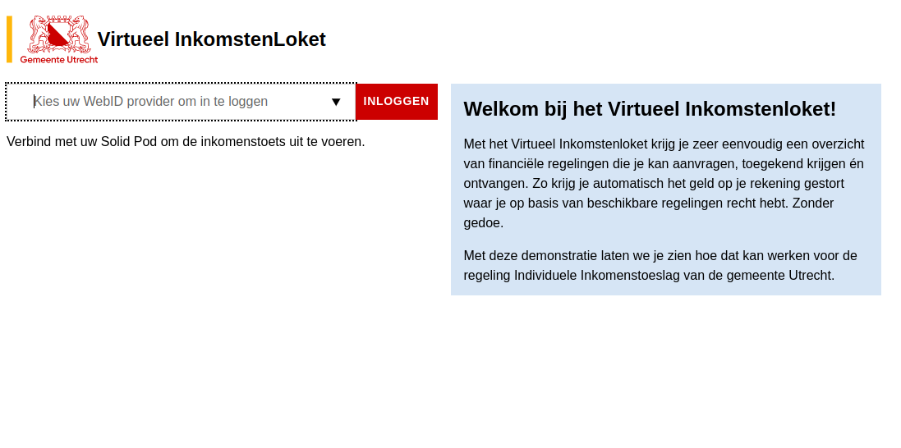
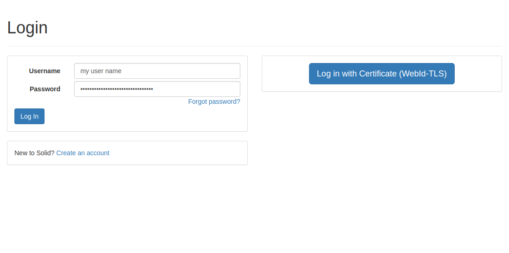
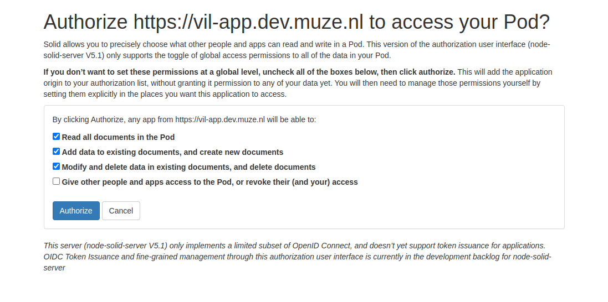
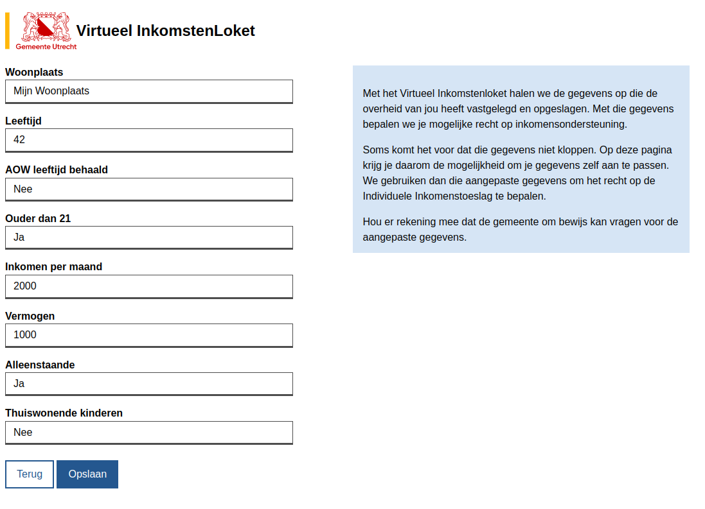
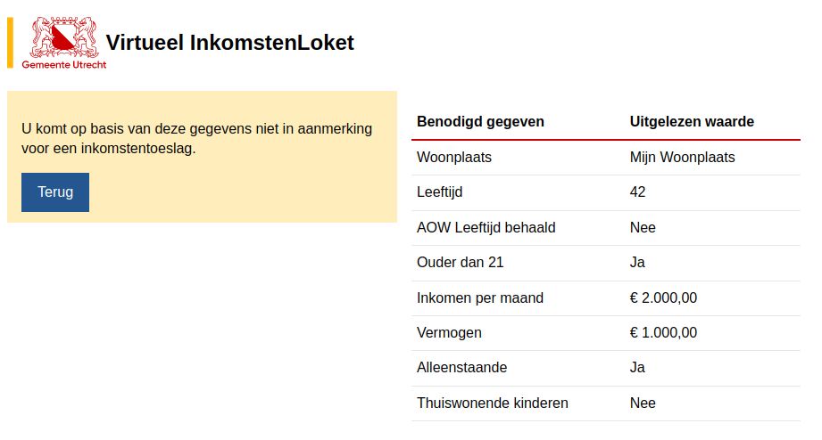
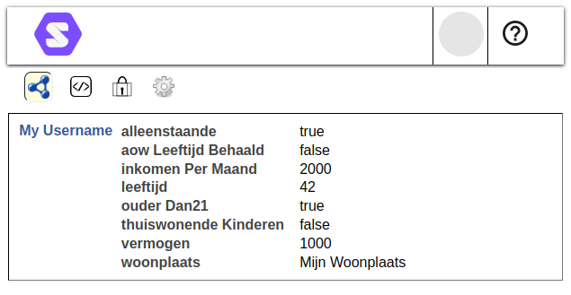

# Virtueel Inkomstenloket App

[![Muze][muze-shield]][muze-site]
[![SimplyEdit][simplyedit-shield]][simplyedit-site]
[![Solid][solid-shield]][solid-site]
[![standard-readme compliant][standard-readme-shield]][standard-readme-link]
[![License][license-shield]][license-link]

Project to demonstrate how an application for the [Virtueel Inkomstenloket][vil-site]
could look, using Solid as a data storage. The application demonstrates
how this would look for the [Regeling Individuele Inkomenstoeslag][inkomenstoeslag-site]
of the [Municipality of Utrecht][utrecht-site].

**⚠ This is a demo application, please do not provide any sensitive or personal information in this application!**

## Install

No installation needed. A live version can be visited at: https://vil.mijnsolidpod.nl/

## Usage

1. Visit the application and provide a Solid WebId 
   
2. Log in with your Solid Pod
   
3. Authorize the application to access your Solid Pod 
   
4. Provide the requested information 
   
5. The application will show you if you are eligible for the [Regeling Individuele Inkomenstoeslag][inkomenstoeslag-site] 
   
6. The information is stored in your Solid Pod 
    

## Development

This application is built in [SimplyCode][simplycode-site],
a low-code development platform for creating web applications.

This project is based on (i.e. is a fork of) the [SimplyCode skeleton][simplycode-skeleton],
which is a template for creating new SimplyCode projects.

To edit the application, the `www` directory needs to be served over `https`,
using Apache and PHP. How to run Apache is out of scope for this document.

Open SimplyCode by visitng the `/simply-code/` directory in a web browser.

Depending on the server setup, ownership of the following directories may need 
to be changed to the user that runs Apache (usually `www-data`):

- `www/data`
- `www/files`
- `www/img`
- `www/api/data`

This will ensure that you won't push any changes to your new project in this repository.

Another option is to fork this repository and work from that version.

## License

Created by [Muze B.V.][muze-site] under an [MIT license][license-link].

[inkomenstoeslag-site]: https://www.rijksoverheid.nl/onderwerpen/participatiewet/vraag-en-antwoord/individuele-inkomenstoeslag
[license-link]: ./LICENSE
[license-shield]: https://img.shields.io/github/license/muze-nl/vil-app.svg
[muze-shield]: https://img.shields.io/badge/%7BU%7D-Muze-BF1E2E.svg?labelColor=BF1E2E
[muze-site]: https://muze.nl
[muze-site]: https://www.muze.nl/
[simplycode-site]: https://github.com/SimplyEdit/simplycode
[simplycode-skeleton]: https://github.com/SimplyEdit/simplycode-skeleton
[simplyedit-shield]: https://img.shields.io/badge/Simply-Edit-F26522?labelColor=939598
[simplyedit-site]: https://simplyedit.io/
[solid-shield]: https://img.shields.io/badge/Solid-App-7C4DFF.svg?logo=data%3Aimage%2Fsvg%2Bxml%3Bbase64%2CPHN2ZyB4bWxucz0naHR0cDovL3d3dy53My5vcmcvMjAwMC9zdmcnIGZpbGw9JyNGN0Y3RjcnIHZpZXdCb3g9JzAgMCAzNTIgMzIyJz48cGF0aCBkPSdNODggMjgyIDI3IDE3N2MtNS0xMC01LTIyIDAtMzJMODggNDBjNi0xMCAxNi0xNiAyNy0xNmgxMjJjMTEgMCAyMSA2IDI3IDE2bDYxIDEwNmM1IDkgNSAyMSAwIDMxbC02MSAxMDVjLTYgMTAtMTYgMTYtMjcgMTZIMTE1Yy0xMSAwLTIxLTYtMjctMTZ6Jy8+PHBhdGggZmlsbD0nIzdDNERGRicgZD0nbTkzIDI3NS01Ny05OWMtNS05LTUtMjAgMC0zMGw1Ny05OWM1LTkgMTUtMTQgMjYtMTRoMTE0YzExIDAgMjEgNSAyNiAxNGw1NyA5OWM1IDEwIDUgMjEgMCAzMGwtNTcgOTljLTUgOS0xNSAxNS0yNiAxNUgxMTljLTExIDAtMjEtNi0yNi0xNXonLz48cGF0aCBkPSdNMTE4IDE0MmgxMThsMy0ydi0yMmMwLTE1LTEyLTI3LTI3LTI3aC03MGMtMjEgMC0zOCAxNy0zOCAzNyAwIDggNyAxNCAxNCAxNHptMTIgOThoNzBjMjEgMCAzOS0xOCAzOS0zOSAwLTctNi0xMy0xMy0xM0gxMDdjLTIgMC0zIDItMyAzdjIzYzAgMTQgMTIgMjYgMjYgMjZ6Jy8+PHBhdGggZD0nbTExMCAxMzkgODcgODhjNiA2IDE1IDYgMjEgMGwxNS0xNWM2LTYgNi0xNSAwLTIxbC04Ny04OGMtNi02LTE1LTYtMjEgMGwtMTUgMTVjLTYgNi02IDE2IDAgMjF6Jy8+PHBhdGggZmlsbD0nIzQ0NCcgZD0nbTE5OSAyMjgtNTItNDBoMTJ6bS01NS0xMjYgNDEgNDBoMTR6Jy8+PC9zdmc+
[solid-site]: https://solidproject.org/
[standard-readme-link]: https://github.com/RichardLitt/standard-readme
[standard-readme-shield]: https://img.shields.io/badge/-Standard%20Readme-brightgreen.svg
[utrecht-site]: https://www.utrecht.nl/
[vil-site]: https://vng.nl/projecten/virtueel-inkomsten-loket
